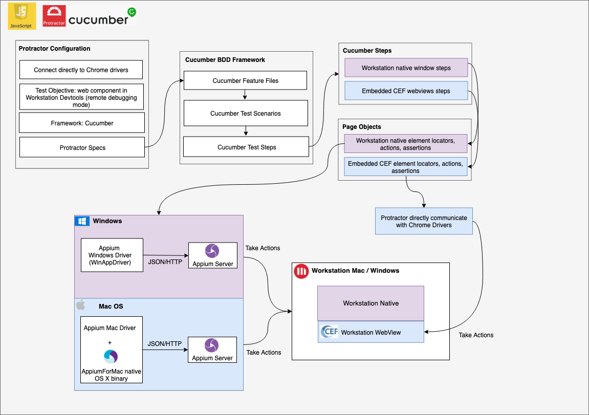
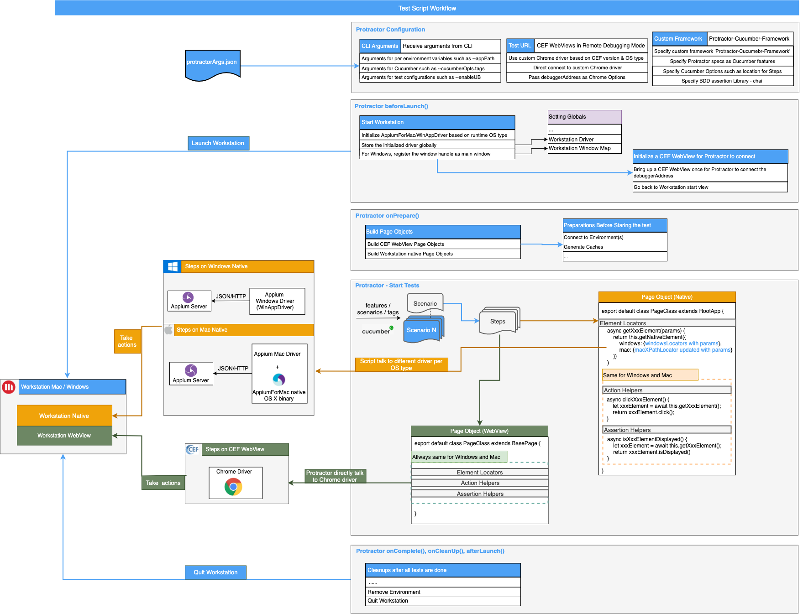

# Workstation E2E Test Automation Framework Architecture

This test framework helps to automate E2E user interactions with Workstation Windows and Mac. It is based on [Protractor](https://github.com/angular/protractor), [Cucumber](https://github.com/cucumber/cucumber) and [Appium](https://github.com/appium/appium). With Cucumber we can define test scenarios with detail test steps in Cucumber feature files in plain language. The test steps will either manipulate the Workstation native elements (such as Workstation Menus) or the elements in the embedded CEF webview (such as Dossier Editor). The native part can be automated via [appium-windows-driver](https://github.com/appium/appium-windows-driver) and [appium-mac-driver](https://github.com/appium/appium-mac-driver), using admc/wd[https://github.com/admc/wd] library. The CEF WebView part can be automated via Chrome driver and [WebDriverJS](https://github.com/SeleniumHQ/selenium/wiki/WebDriverJs) library which is wrapped in Protractor. Protractor also helps to integrate everything into one framework.

The philosophy of this test framework is:
- It should apply to both Workstation Windows and Mac, as functionality-wise, Workstation Windows and Mac should have no gap.
- It should reuse the automation script for Web Component for Workstation Windows and Mac, as the same shared Web Components will be used.
- It should reuse the other reusable patterns, such as implementation for element actions and assertions.

## Protractor with Custom BDD Test Framework Cucumber
Cucumber is BDD framework allows us to write our specs based on the behavior of the application and can provide a higher-level view of what has been tested against. Cucumber feature files are specified as Protracotr specs in Protractor-Cucumber-Framework. Features are composed of one or multiple test scenarios, and each test scenario is composed of several test steps.

If one functionality is supported both in Workstation Mac and Windows, the test feature/scenario generally should be the same to ensure the same test coverage.

## Different Drivers

### Workstation Native - Appium OS Drivers
To interact with Workstation, we need drivers supporting automation of Windows PC Desktop applications / OS X desktop applications. Appium is selected since it has the abilitiy to automate both Windows and Mac Desktop apps. For Windows, Appium relies on a project from MicroStrategy called WinAppDriver(WAD). For Mac, Appium has its appium-mac-driver and relies on a native OS X binary called AppiumForMac. WAD supports more types of element locators such as byClassName and byName, while appium-mac-driver for only supports AXPath. Please refer to [native locator strategies](./native-locator-strategy.md) for more details. WD library is used to talk to the OS drivers as a WebDriver client.

### CEF WebView - Chrome Driver (Protractor)
To interact with the CEF WebView embedded in Workstation application, it requires the Chrome driver of the matched version of the CEF WebView. That is why custom Chrome drivers are specified in Protractor. CEF supports remote debug mode that is a visitable web URL, so Protractor can directly connect to the URL to manipulate these DOM elements. The Protractor in-built WebDriverJS library is used to directly talk to the Chrome Driver.

Note: CEF remote debug URL is only accessible after a CEF WebView has been initialized. That is why some WebView initialization tasks are specified in the beforeLaunch() methond of Protractor.

## Page Object Design Pattern

We applied the Page Object Design Pattern to both Workstation application native sections and the embedded CEF WebViews in this Test Framework. A page object is an object-oriented class which stores specific page elements, element methods and assetions related to what will happen after these element actions. Test Suites use the methods of these page object classes whenever they need to interact with the user interface of those pages.
 
### Page Object Class
Each page object should consist of 3 types of JavaScript methods:

* Element locator method: Element locator method returns the native/WebView element promise which contains specific element location information
* Action helper method: Action helper method mainly calls Element locator methods to locate elements, and perform actions simulating end user actions, such as click, hover, keyboard type, etc.
* Assertion helper method: Assertion helper method returns data wrapped in promise which can be used in the test case scripts for assertion

Page Objects for CEF WebView is reusable between Workstation Windows and Mac.
Page Objects for Workstation native pages can share the same Action helper methods and Assertion helper methods, only the way how the elements are located are different. 

### Base Page Object Class
A Base Page Object Class contains reusable methods across multiple page object classes.

### Page Builder Function
Entire set of page objects are instantiated during intial Protractor run-time configuration, and passed to the corresponding test suite files. In this way we can create circular reference as necessary between page objects.

## Framework Diagram in Detail

