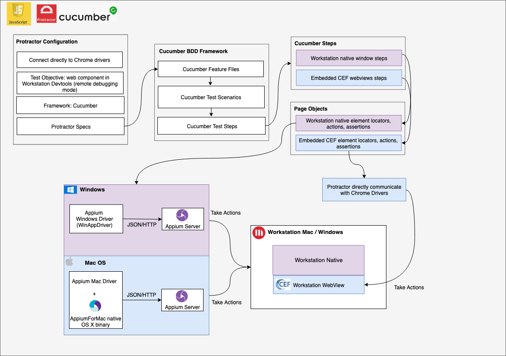
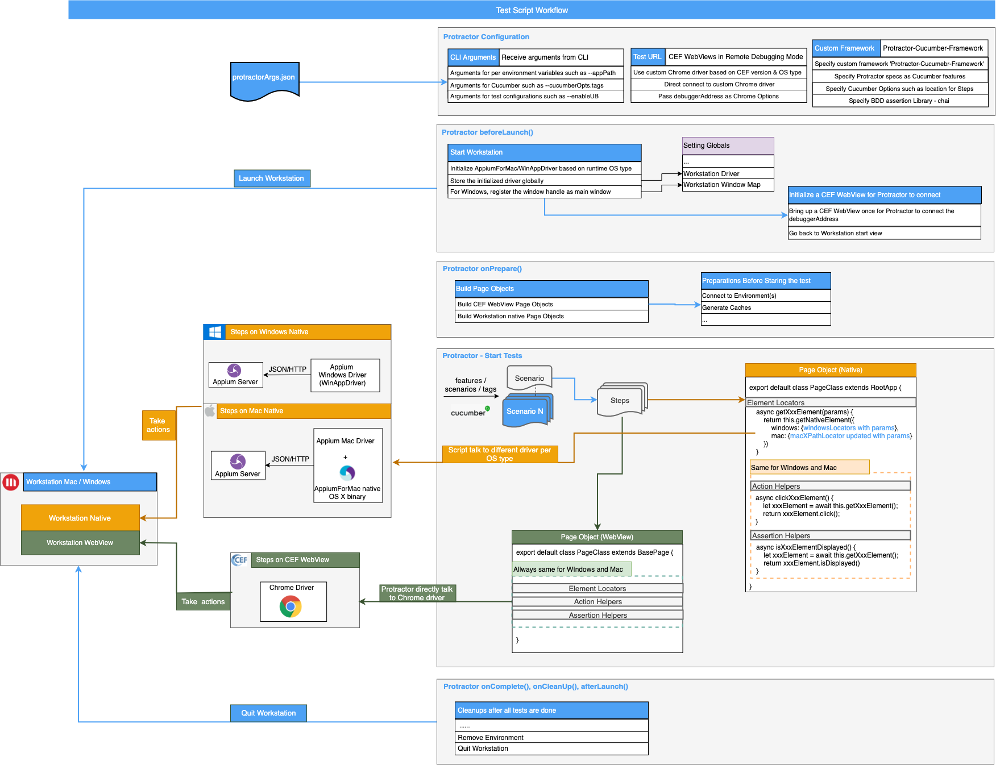

# Workstation E2E Test Automation Framework Architecture

This test framework helps to automate E2E user interactions with Workstation Windows and Mac. It is based on [Protractor](https://github.com/angular/protractor), [Cucumber](https://github.com/cucumber/cucumber) and [Appium](https://github.com/appium/appium). With Cucumber we can define test scenarios with detail test steps in Cucumber feature files in plain language (Gherkin). The test steps will either manipulate the Workstation native elements (such as Workstation Menus) or the elements in the embedded CEF webview (such as Dossier Editor). The native part can be automated via [appium-windows-driver](https://github.com/appium/appium-windows-driver) and [appium-mac-driver](https://github.com/appium/appium-mac-driver), using admc/wd[https://github.com/admc/wd] library. The CEF WebView part can be automated via Chrome driver and [WebDriverJS](https://github.com/SeleniumHQ/selenium/wiki/WebDriverJs) library which is wrapped in Protractor. Protractor also helps to integrate everything into one framework.

The philosophy of this test framework is:
- It should apply to both Workstation Windows and Mac, as functionality-wise, Workstation Windows and Mac should have no gap.
- It should reuse the automation script for Web Component for Workstation Windows and Mac, as the same shared Web Components will be used for both.
- It should reuse the other reusable patterns, such as implementation for element actions and assertions.

## Protractor with Custom BDD Test Framework Cucumber
Cucumber is BDD framework allows us to write our specs based on the behavior of the application and can provide a higher-level view of what has been tested against. Cucumber feature files are specified as Protracotr specs in Protractor-Cucumber-Framework. Features are composed of one or multiple test scenarios, and each test scenario is composed of several test steps.

If one functionality is supported both in Workstation Mac and Windows, the test feature/scenario generally should be the same to ensure the same test coverage.

To read more, check [here](https://microstrategy.atlassian.net/wiki/spaces/AB/pages/841884307/0+-+Introduction+of+Plugin+App+Test+Framework)

## More Detailed Framework Diagram

