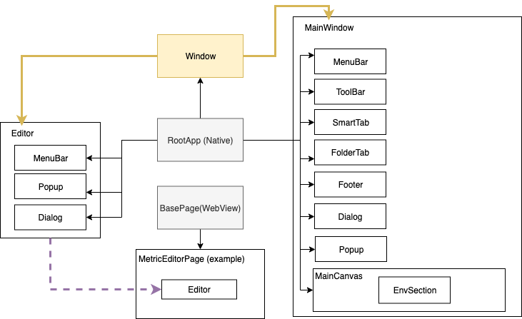

# Page Object Design Pattern
We applied the Page Object Design Pattern to both Workstation application native sections and the embedded CEF WebViews in this Test Framework. A page object is an object-oriented class which stores specific page elements, element methods and assetions related to what will happen after these element actions. Test Suites use the methods of these page object classes whenever they need to interact with the user interface of those pages.

## Page Object Classes
We typically add any of the web or native pages under the `pages` folder. All the page objects are categorized in 2 folder - Native Page Objects & Web Pages Objects. 

Each page object file should consist of 3 types of JavaScript methods:
* Element locator method: Element locator method returns the native/WebView element promise which contains specific element location information
* Action helper method: Action helper method mainly calls Element locator methods to locate elements, and perform actions simulating end user actions, such as click, hover, keyboard type, etc.
* Assertion helper method: Assertion helper method returns data wrapped in promise which can be used in the test case scripts for assertion

## Base Page Object Class
A Base Page Object Class contains reusable methods across multiple page object classes. 
* All the native pages extend RootApp. [`RootApp.js`](../pages/basePages/RootApp.js) contains all the common methods used by other page objects.
* All the web pages extend BasePage. [`BasePage.js`](../pages/basePages/BasePage.js) contains all the common methods used for by other pages. And in its constructor we define these variables for easier usage throughout all the web pages 

## Page Builder Function
The entire set of page objects is instantiated during the initial Protractor run-time configuration and passed to the corresponding test suite files. In this way, we can create a circular reference as necessary between page objects. 
* The [`PageBuilder`](../pages/pageBuilder.js) function returns instances for all the page objects except for the Base Page Objects.
Page Objects for CEF WebView is reusable between Workstation Windows and Mac. Page Objects for Workstation native pages can share the same Action helper methods and Assertion helper methods, only the way how the elements are located are different.